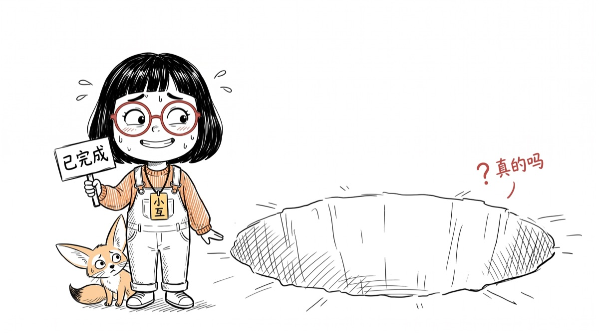
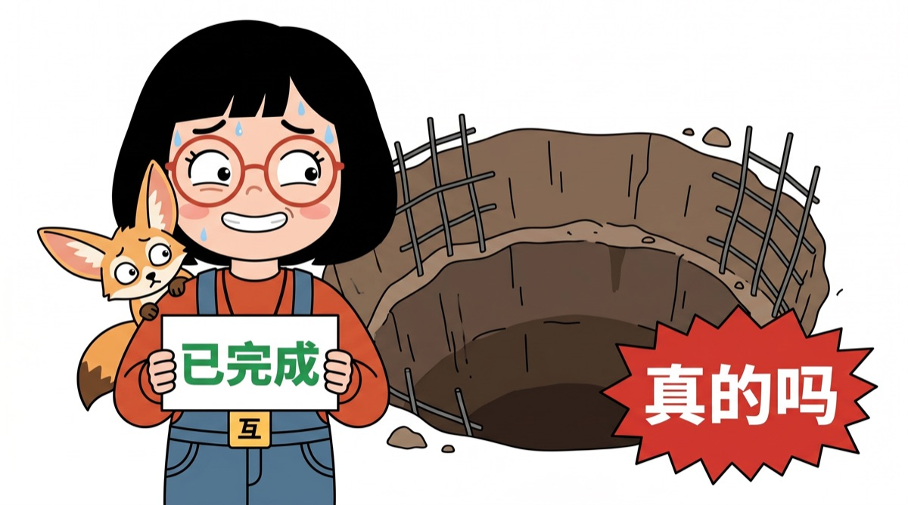
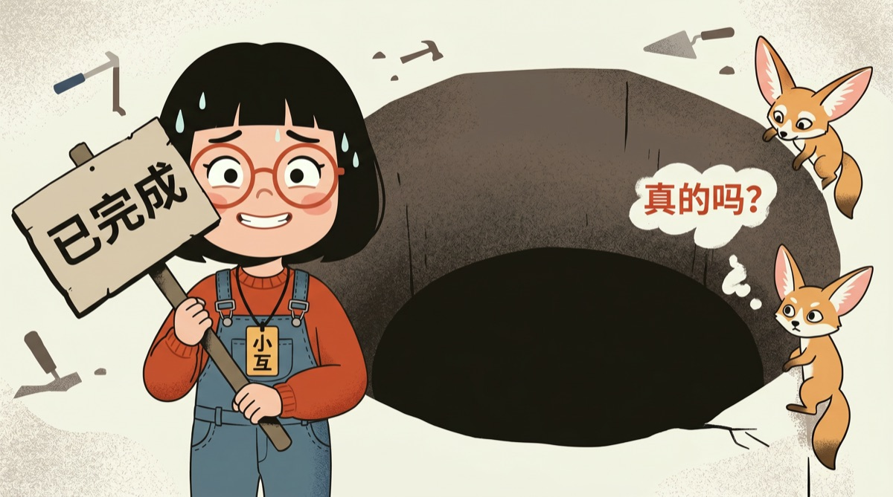
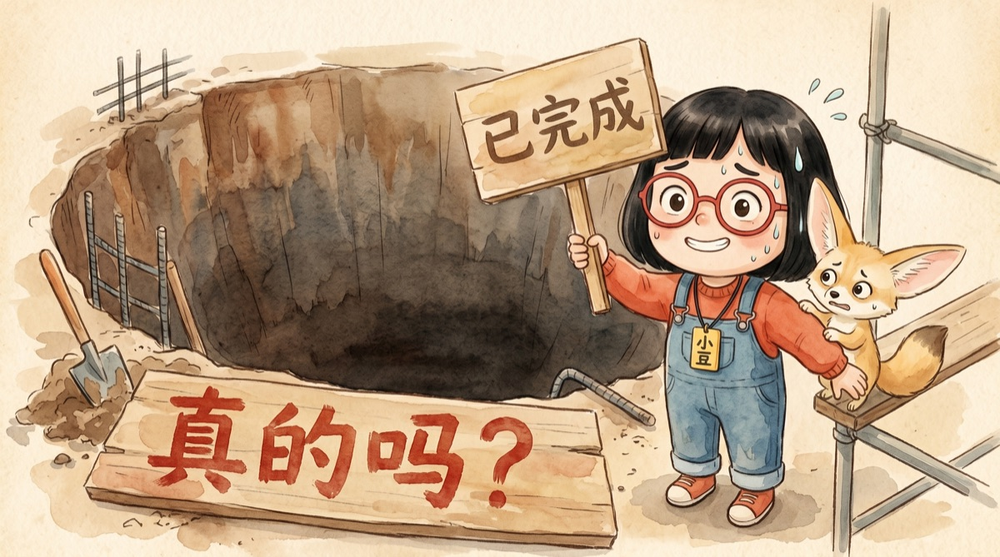
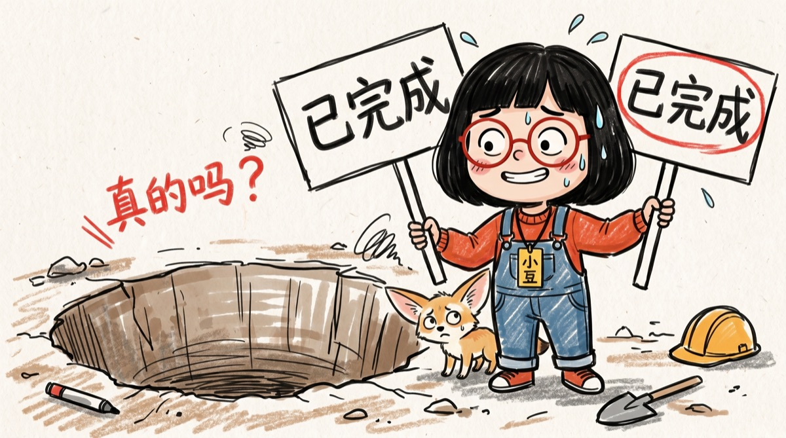

# xiaohu-illustrator 小互隐喻配图引擎

一个 Claude Code 技能:为中文深度文/方法拆解/产品解读生成**带固定 IP 角色的正文配图**。不是通用插画,不是样式库随机选风格——是把文章里一个关键判断/流程/机制,变成一张有记忆点、一眼怪但一秒懂的图。

核心方法:**挑认知锚点 → 深层提炼 → 现编隐喻 → 三轨分流 → 反 PPT 自检**。AI 负责画,这套流程负责"想清楚画什么"——后者才是配图的难点。

## 效果

| 3D 盲盒(默认) | 黑白线稿 | 扁平矢量 |
|---|---|---|
|  |  |  |

| 编辑插画 | 水彩淡彩 | 马克笔手账 |
|---|---|---|
|  |  |  |

同一个角色,7 种画风皮肤,每篇按文章调性选一种:

| 皮肤 | 适合 |
|---|---|
| 3D 盲盒手办(默认) | 产品发布、封面级吸睛、强 IP 感 |
| 黑白线稿 | 深度解读,不抢文字,留白呼吸 |
| 扁平矢量 | 教程、信息清晰、量产 |
| 编辑插画(纽约客风) | 观点文、深度评论、有态度 |
| 水彩淡彩 | 人文向、温暖叙事 |
| 马克笔手账 | 轻松话题、梗图感 |
| 混合媒介(手绘草图+写实物体) | 信息图、强视觉冲击的对比 |

**角色锁定、画风可换、表情随内容情绪变化**——这是和"每张图风格随机"的根本区别。想要列表之外的画风,上传几张喜欢的参考图让 Claude 提炼成新皮肤即可,见 `references/style-dna.md`「怎么创建你自己的皮肤」。

## 它帮你干了什么(全自动程度)

你只需要丢给它一篇文章,说"给这篇配几张图"。剩下全是它的活:

- **自动读全文、逐节分析**——文章每一节列进计划表,逐节判断"配不配 + 为什么",不用你指定哪里要图
- **自动判断每张图的类型**——读者没共鸣的段落配情绪图,看不懂结构的段落配解释图,有时间线转折的段落配四格漫画
- **自动深挖**——每张图动笔前先回答"作者真意是什么、张力在哪、读者该留下哪句顿悟",防止画出"看起来配了图,信息量是零"的废图
- **自动编隐喻、写提示词、定比例**——隐喻按这篇文章现编不复用旧图,比例按每张内容判断(手机阅读偏竖版)
- **自动生成 + 自动质检**——批量前先出一张基准图定调,生完按反 PPT 清单逐项自检,不合格的重生

你全程只做两个决定:**生图前确认一遍清单**(哪节配、画什么,烧 API 前拦住返工),**选一次画风皮肤**。其余不用操心。

## 设计理念(为什么做成这样)

1. **一张图要么帮读者懂,要么帮读者记,两样都做不到就不配。** 大部分配图是装饰,读者一眼划过;本技能"配不配"的所有规则都从这条推出来:文字说透的点不配,难懂的机制必须配
2. **固定角色是辨识度资产。** 读者在信息流里先认出角色再认出你,每篇文章都在往同一个账户存辨识度。这是和样式库型方案(如 baoyu-article-illustrator,每篇换风格,灵活但不积累)的根本分野:那个管"每篇好看",这个管"每篇都像你"
3. **配图的难点不是画,是想清楚画什么。** 生图模型已经够强,短板在思考层,所以本技能九成篇幅花在"想"(锚点/提炼/隐喻/分轨),画只是最后一步

## 它解决什么问题

AI 配图的三个常见死法:

1. **画成 PPT**——贴满图标和方框的"专业示意图",读者一张都不会停下来看
2. **风格漂移**——一篇文章 6 张图 6 种画风,像 6 个号拼出来的
3. **图解表面**——文字说"三家竞争"就画三条赛道,没有任何文字之外的信息增量

本技能对应三道防线:反 PPT 负向清单(`anti-ppt-qa.md`)、视觉契约六维锁定(`style-dna.md`)、深层提炼三问+内容锁定(`deep-reading.md`)。

## 安装

```bash
git clone https://github.com/xiaohuailabs/xiaohu-illustrator.git ~/.claude/skills/xiaohu-illustrator
```

重启 Claude Code,对它说"给这篇文章配几张隐喻图"即可触发。

## 生图途径怎么解决(三条路任选)

技能本身负责"想清楚画什么 + 组好提示词",实际出图需要一个支持「文生图 + 参考图」的途径。按你的情况选:

**路 1:已有 API(最顺)。** OpenAI GPT-image 系列(推荐,中文标注准、参考图锁角色稳)或 Gemini 图像模型。把 key 给 Claude Code,让它写个调用脚本,一次写好反复用。OpenAI 兼容的第三方中转端点同样能跑(`/v1/images/generations` 形态,参考图走 `image_urls` 字段)。

**路 2:没有 API,想配一个。** 对 Claude Code 说"帮我写一个调 OpenAI 图像 API 的生图脚本",它会带你把 key 申请、脚本、落盘目录一次配好。成本量级(2026 年中,以[官方定价页](https://openai.com/api/pricing/)为准):GPT-image 高质量一张约 0.21 美元,中等质量约 0.05 美元;一篇文章 6-8 张高质量图约 1.5 美元。Gemini 图像 API 约 0.07 美元一张(1K 分辨率,无免费档)。

**路 3:一分钱不花(手动)。** 让技能把每张图的完整英文提示词输出给你,自己贴到 ChatGPT / Gemini 网页版生成,参考图手动上传,生成的图存回本地。慢,但零成本,先体验流程够用了。

两条硬要求(走 API 时):能传 1-2 张参考图(锁角色),能指定画幅比例。详见 `SKILL.md`「依赖」一节。

## 使用

```
给这篇文章配几张隐喻图: <文章路径>
```

流程(细节见 SKILL.md):

1. **逐节枚举**——文章每一节列进计划表,逐节判"配/不配"+理由,不凭感觉挑
2. **深层提炼**——每个配图点回答:作者真意?张力在哪?读者该留下哪句顿悟?
3. **三轨分流**——没共鸣→情绪图 / 没看懂结构→解释图 / 有转折时间线→四格漫画
4. **shot list 确认**——烧 API 前把整张计划表给你过目
5. **基准图先行**——先生 1 张定调,对了再批量,防全篇风格漂移
6. **QA 自检**——反 PPT 清单逐项核对,命中失败信号就重生

可选参数:`--style 3d/sketch/flat/...`(画风皮肤)、`--ratio 4:3`(强制统一比例)、`--density 精简/均衡/丰富`(配图密度)。

## 把小互换成你自己的角色(建议)

小互(红框眼镜+齐刘海+橙红背带裤+狐狸搭档)是仓库自带的示例 IP,装上就能跑。但**方法可以共享,辨识度只能是你自己的**。换角色不用手动改文件,对 Claude 说话就行:

- **已有 IP 形象**:"这是我的 IP 形象,帮我换进配图技能"+ 上传图。Claude 看图提炼识别符号、写角色档案、把图存成锚点、替换模板,一次完成
- **从零造一个**:描述想要的角色("帮我设计一个戴圆眼镜的橘猫程序员"),或上传几张喜欢的参考图说"就要这种感觉"。Claude 给出 2-3 版候选让你挑,定稿后补齐锚点图和档案

内部流程细节见 [`references/customize-your-ip.md`](references/customize-your-ip.md)。

## 方法来源

本技能的方法骨架借鉴自两个项目,完整的"借了什么/没借什么"记录见 [`references/血统.md`](references/血统.md):

- [helloianneo/ian-xiaohei-illustrations](https://github.com/helloianneo/ian-xiaohei-illustrations) —— 认知锚点筛选、原创隐喻三步法、反 PPT 防线的结构
- [JimLiu/baoyu-skills](https://github.com/JimLiu/baoyu-skills) 的 baoyu-article-illustrator —— 文字渲染铁律、结构化 prompt 字段、配图密度参数

小黑的 IP 没有碰(那是 Ian 的招牌),小互是独立设计的角色——也建议你这样对待小互。

## License

MIT(代码与方法文档)。小互 IP 形象仅作示例用途,商用请替换为你自己的角色。
